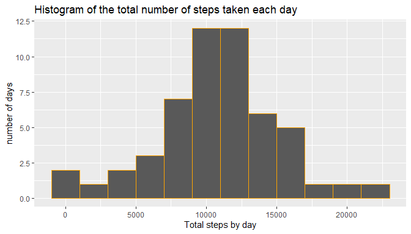
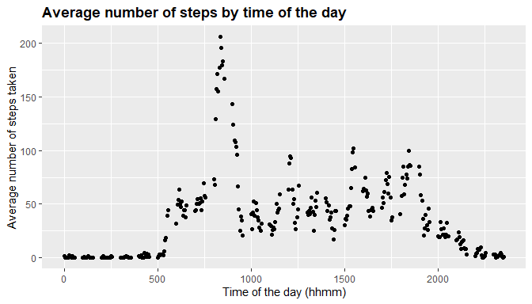
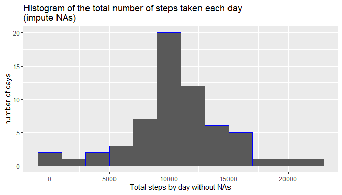
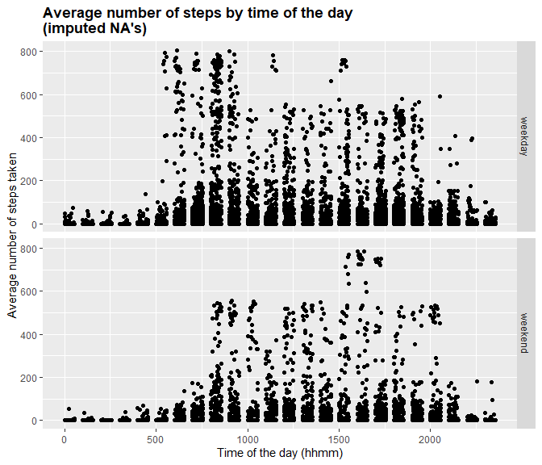

Project Assignment 1 - Reproducible Research
==============================================
## Load data set


```r
url<- "https://d396qusza40orc.cloudfront.net/repdata%2Fdata%2Factivity.zip"
download.file(url,destfile = "data.zip",mod="wb")
unzip("data.zip",exdir = ".")
df<-read.csv("activity.csv",header=T)
```

## Data structure

```r
nrow(df)
```

```
## [1] 17568
```

```r
summary(df)
```

```
##      steps            date              interval     
##  Min.   :  0.00   Length:17568       Min.   :   0.0  
##  1st Qu.:  0.00   Class :character   1st Qu.: 588.8  
##  Median :  0.00   Mode  :character   Median :1177.5  
##  Mean   : 37.38                      Mean   :1177.5  
##  3rd Qu.: 12.00                      3rd Qu.:1766.2  
##  Max.   :806.00                      Max.   :2355.0  
##  NA's   :2304
```

```r
str(df)
```

```
## 'data.frame':	17568 obs. of  3 variables:
##  $ steps   : int  NA NA NA NA NA NA NA NA NA NA ...
##  $ date    : chr  "2012-10-01" "2012-10-01" "2012-10-01" "2012-10-01" ...
##  $ interval: int  0 5 10 15 20 25 30 35 40 45 ...
```
## Load libraries

```r
library(ggplot2)
```

```
## Warning: package 'ggplot2' was built under R version 4.0.3
```

```r
library(tidyverse)
```

```
## Warning: package 'tidyverse' was built under R version 4.0.5
```

```
## -- Attaching packages --------------------------------------- tidyverse 1.3.1 --
```

```
## v tibble  3.1.1     v dplyr   1.0.5
## v tidyr   1.1.3     v stringr 1.4.0
## v readr   1.4.0     v forcats 0.5.1
## v purrr   0.3.4
```

```
## Warning: package 'tibble' was built under R version 4.0.5
```

```
## Warning: package 'tidyr' was built under R version 4.0.5
```

```
## Warning: package 'readr' was built under R version 4.0.3
```

```
## Warning: package 'dplyr' was built under R version 4.0.5
```

```
## -- Conflicts ------------------------------------------ tidyverse_conflicts() --
## x dplyr::filter() masks stats::filter()
## x dplyr::lag()    masks stats::lag()
```

```r
library(xtable)
```
## Modifying the dataset

```r
df[,2]<- as.Date(df[,2])
str(df)
```

```
## 'data.frame':	17568 obs. of  3 variables:
##  $ steps   : int  NA NA NA NA NA NA NA NA NA NA ...
##  $ date    : Date, format: "2012-10-01" "2012-10-01" ...
##  $ interval: int  0 5 10 15 20 25 30 35 40 45 ...
```

```r
df<-as_tibble(df)
```
## What is mean total number of steps taken per day?

```r
steps_by_day<-df %>% 
  group_by(date) %>%  
  summarize(total_steps_by_day=sum(steps))
steps_by_day
```

```
## # A tibble: 61 x 2
##    date       total_steps_by_day
##    <date>                  <int>
##  1 2012-10-01                 NA
##  2 2012-10-02                126
##  3 2012-10-03              11352
##  4 2012-10-04              12116
##  5 2012-10-05              13294
##  6 2012-10-06              15420
##  7 2012-10-07              11015
##  8 2012-10-08                 NA
##  9 2012-10-09              12811
## 10 2012-10-10               9900
## # ... with 51 more rows
```

```r
par(mar=c(5,4,1,1))
ggplot(steps_by_day) +
  geom_histogram(mapping=aes(total_steps_by_day),
                 na.rm=T,color="orange",
                 binwidth = 2000) + 
  ggtitle("Histogram of the total number of steps taken each day") +
  labs(x="Total steps by day", y="number of days")
```

<!-- -->

```r
xt <- xtable(steps_by_day %>% 
               summarize(mean = mean(total_steps_by_day,na.rm = T),
                         median = median(total_steps_by_day,
                                         na.rm = T)))
print(xt,type="html")
```

<!-- html table generated in R 4.0.2 by xtable 1.8-4 package -->
<!-- Thu Jul 08 23:49:52 2021 -->
<table border=1>
<tr> <th>  </th> <th> mean </th> <th> median </th>  </tr>
  <tr> <td align="right"> 1 </td> <td align="right"> 10766.19 </td> <td align="right"> 10765 </td> </tr>
   </table>
## What is the average daily activity pattern?

```r
df2<- df %>% 
  group_by(interval) %>% 
  summarize(mean_steps=mean(steps,na.rm=T))

ggplot(df2,aes(interval,mean_steps)) + 
  geom_point() + 
  ggtitle("Average number of steps by time of the day") +
  labs(x="Time of the day (hhmm)", 
       y = "Average number of steps taken") + 
  theme(plot.title = element_text(face="bold"))
```

<!-- -->

```r
xt <- xtable(df2 %>% 
               summarize(df2[which.max(mean_steps),1], 
                         Max = max(mean_steps)))
print(xt,type="html")
```

<!-- html table generated in R 4.0.2 by xtable 1.8-4 package -->
<!-- Thu Jul 08 23:49:54 2021 -->
<table border=1>
<tr> <th>  </th> <th> interval </th> <th> Max </th>  </tr>
  <tr> <td align="right"> 1 </td> <td align="right"> 835 </td> <td align="right"> 206.17 </td> </tr>
   </table>
## Imputing missing values

```r
paste("Total of NAs in dataset : ",sum(is.na(df)))
```

```
## [1] "Total of NAs in dataset :  2304"
```

```r
a<-df %>% 
  filter (is.na(df)) %>% 
  right_join(df2,by = "interval") %>% 
  mutate(steps = mean_steps) %>% 
  select(steps,date,interval)
b<-df %>% 
  filter (!is.na(df)) 
df4<-bind_rows(a,b)
summary(df)
```

```
##      steps             date               interval     
##  Min.   :  0.00   Min.   :2012-10-01   Min.   :   0.0  
##  1st Qu.:  0.00   1st Qu.:2012-10-16   1st Qu.: 588.8  
##  Median :  0.00   Median :2012-10-31   Median :1177.5  
##  Mean   : 37.38   Mean   :2012-10-31   Mean   :1177.5  
##  3rd Qu.: 12.00   3rd Qu.:2012-11-15   3rd Qu.:1766.2  
##  Max.   :806.00   Max.   :2012-11-30   Max.   :2355.0  
##  NA's   :2304
```

```r
summary(df4)
```

```
##      steps             date               interval     
##  Min.   :  0.00   Min.   :2012-10-01   Min.   :   0.0  
##  1st Qu.:  0.00   1st Qu.:2012-10-16   1st Qu.: 588.8  
##  Median :  0.00   Median :2012-10-31   Median :1177.5  
##  Mean   : 37.38   Mean   :2012-10-31   Mean   :1177.5  
##  3rd Qu.: 27.00   3rd Qu.:2012-11-15   3rd Qu.:1766.2  
##  Max.   :806.00   Max.   :2012-11-30   Max.   :2355.0
```

```r
steps_by_day2<-df4 %>% 
  group_by(date) %>%  
  summarize(total_steps_by_day2=sum(steps))
steps_by_day2
```

```
## # A tibble: 61 x 2
##    date       total_steps_by_day2
##    <date>                   <dbl>
##  1 2012-10-01              10766.
##  2 2012-10-02                126 
##  3 2012-10-03              11352 
##  4 2012-10-04              12116 
##  5 2012-10-05              13294 
##  6 2012-10-06              15420 
##  7 2012-10-07              11015 
##  8 2012-10-08              10766.
##  9 2012-10-09              12811 
## 10 2012-10-10               9900 
## # ... with 51 more rows
```

```r
par(mar=c(5,4,1,1))
ggplot(steps_by_day2) +
  geom_histogram(mapping=aes(total_steps_by_day2),
                 na.rm=TRUE,color="blue",
                 binwidth = 2000) + 
  ggtitle("Histogram of the total number of steps taken each day \n(impute NAs)") +
  labs(x="Total steps by day without NAs", y="number of days")
```

<!-- -->

```r
xt <- xtable(steps_by_day2 %>% 
               summarize(mean = mean(total_steps_by_day2,
                                     na.rm = T),
                         median = median(total_steps_by_day2,
                                         na.rm = T)))
print(xt,type="html")
```

<!-- html table generated in R 4.0.2 by xtable 1.8-4 package -->
<!-- Thu Jul 08 23:49:57 2021 -->
<table border=1>
<tr> <th>  </th> <th> mean </th> <th> median </th>  </tr>
  <tr> <td align="right"> 1 </td> <td align="right"> 10766.19 </td> <td align="right"> 10766.19 </td> </tr>
   </table>
## Are there differences in activity patterns between weekdays and weekends?

```r
df5<-df4 %>% mutate (day = weekdays(date)) %>% mutate(day = ifelse(day =="lunes"|day =="martes"|day=="miércoles"|day =="jueves"| day =="viernes","weekday","weekend")) %>% mutate(day = factor(day))
```

```r
ggplot(df5,aes(interval,steps)) +
  geom_point() +
  ggtitle("Average number of steps by time of the day\n(imputed NA's)") +
  labs(x="Time of the day (hhmm)", 
       y = "Average number of steps taken") + 
  theme(plot.title = element_text(face="bold")) +
  facet_grid(rows = "day")
```

<!-- -->
